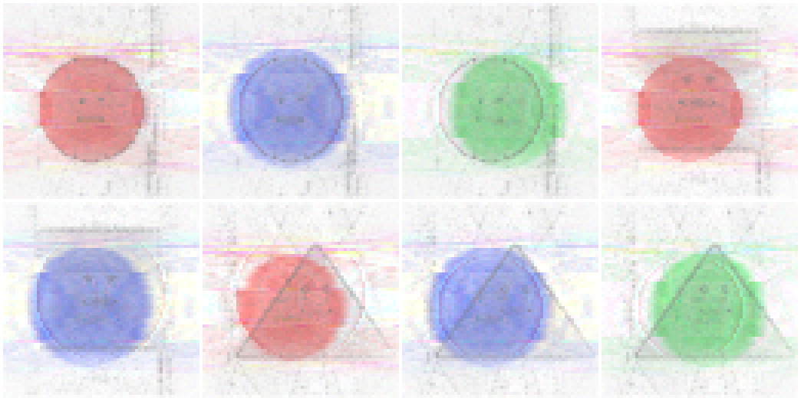
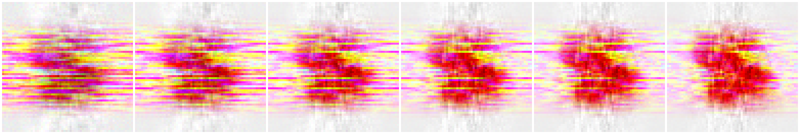
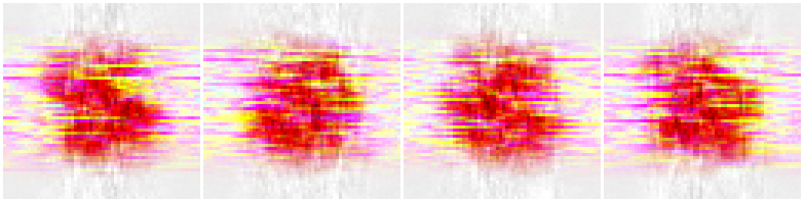
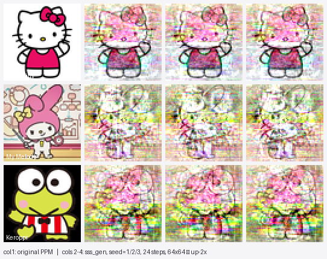
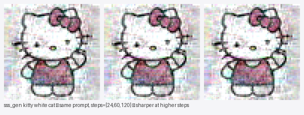
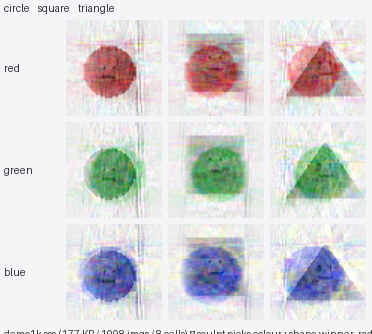
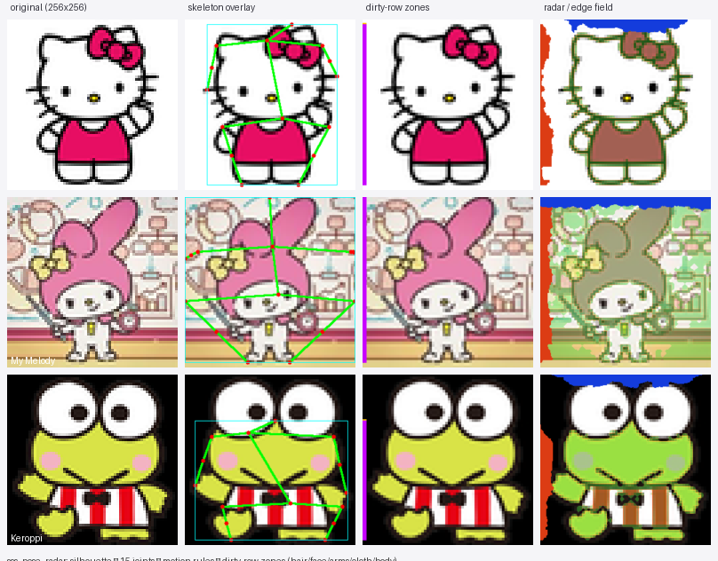
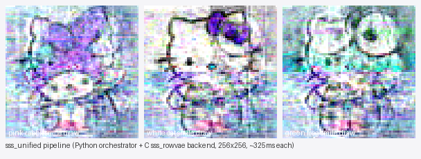

# SSS — Spatial Pattern AI + CE-Cell Image Engine


> A two-engine codebase. **Text** is encoded as brightness patterns on a
> 256×256 grid; **images** decompose into 64-byte `CEUnit` cells with an
> RGBA tick clock and a residual codebook. Both share one storage layer
> and one save file.
>
> Inference is integer-only. Float math (DCT / SVD) appears only at
> training time.

## What's new since the last README cut

This branch lands the full Python perception + orchestration layer on
top of the C engine. Every new module is benchmarked end-to-end on
real character images further down — no hand-waving, all numbers were
produced by the scripts in this repo on the bundled `data/sanrio`
(Hello Kitty / My Melody / Keroppi, 25 PPMs) and `data/sss_demo_1k`
(1008-image synthetic corpus) datasets.

| Module                       | Path                          | What it does                                                                  |
| ---------------------------- | ----------------------------- | ----------------------------------------------------------------------------- |
| **sss_unified**              | `tools/sss_unified.py`        | Single-call orchestrator: parse → memory search → sculpt → motion → evaluate. No noise; deterministic generation. |
| **sss_pose_radar**           | `tools/sss_pose_radar.py`     | silhouette → 15 joints → motion rules → 5 dirty-row zones (hair / face / arms / cloth / body), pure numpy. |
| **sss_ingest**               | `tools/sss_ingest.py`         | label-required image ingest, CSV batch (`path,label`), FFT-based per-row reconstruction. |
| **sss_memory**               | `tools/sss_memory.py`         | `CEMemory.add_cell()` routes through ctypes → `ce_storage_add_typed`; every Python add lands in a real `.ces`. |
| **sss_image_io**             | `tools/sss_image_io.py`       | stdlib-only PNG / PPM read+write — drops the cv2 / Pillow runtime requirement from UI encode. |
| **sss_pybridge**             | `ce_core/sss_pybridge.{c,h}`  | shared library (`libsss_pybridge.so`) exposing `ce_storage_add_typed` and `sss_pybridge_generate` to ctypes. |
| **sss_rowvae** Sculpt + Radio | `ce_core/sss_rowvae.{c,h}`   | Two-stage engine — Sculpt (PR #19 candidate competition) picks the (color, shape, face) winners by row-by-row -MSE scoring, Radio (existing spectrogram tuner) takes those winners' row+column FFTs as targets and tunes amp+phase from spectral noise with a steps-aware α schedule. |
| **Web UI / Forge**           | `ui/unified_server.py`, `ui/unified.html` | unified upload + auto-learn + `/forge` route; cv2-first PNG encoder with stdlib fallback. |
| **Self-upgrade loop**        | `tools/sss_unified.py::run_upgrade_loop` | quality-weighted cell sampling, no cell deletion, integer tick-blend quality update. |

```
   text engine                          image engine
   ───────────────                       ─────────────
   "The cat eats rice."                  256×256 PPM
        │                                    │
   3-layer encode                       16×16 stamp + SLIG decompose
        │                                    │
   256×256 RGBA grid                    CEUnit pyramid (3 scale × 3 chan)
        │                                    │
   keyframe / Δ                         block + SLIG entries (CEStorage)
        │                                    │
   ai_save *.spai                       ce_storage_save *.ces
```

---

## Table of contents

- [What's new since the last README cut](#whats-new-since-the-last-readme-cut)
- [Why this exists](#why-this-exists)
- [Text engine — Spatial Pattern](#text-engine--spatial-pattern)
- [Image engine — CE Cell](#image-engine--ce-cell)
  - [16×16 block stamp](#1-16x16-atomic-block-stamp)
  - [SLIG signal cells](#2-slig-signal-cells)
  - [Hybrid VAE — encode + decode](#3-hybrid-vae)
  - [Masked train](#4-masked-train)
  - [RGBA tick clock + residual codebook](#5-rgba-tick-clock--residual-codebook)
  - [Tick-sorted dynamic decode](#6-tick-sorted-dynamic-decode)
- [End-to-end demo](#end-to-end-demo)
- [Verified results](#verified-results)
- [Spectrogram engine — sss_rowvae (Sculpt + Radio)](#spectrogram-engine--sss_rowvae-sculpt--radio)
- [Python perception / orchestration layer](#python-perception--orchestration-layer)
- [End-to-end benchmarks on real character images](#end-to-end-benchmarks-on-real-character-images)
- [Build & run](#build--run)
- [Save / load formats](#save--load-formats)
- [Project layout](#project-layout)
- [Roadmap](#roadmap)
- [License](#license)

---

## Why this exists

A traditional LLM bakes language into a fixed weight matrix and a
diffusion model bakes images into the same pattern in latent space. Both
are opaque, both retrain instead of incrementally accept new data.

This engine is the inverse:

- **Unlimited parameters** — every new clause / image becomes a frame
  or set of cells, never a retrained weight tensor.
- **Unlimited context** — bounded only by disk.
- **Inspectable** — text grids are heatmaps you can open; image cells
  carry tagged `(scale, channel)` with a documented 64-byte layout.
- **Incremental** — a new clause is one delta or one new keyframe, a
  new image is 1024 block stamps + 9 SLIG sets + a residual codebook
  pass. Never a full retrain.
- **Embedded-friendly** — runs in Termux / on Windows MSYS.
- **Integer at inference** — float only at SVD / DCT during learning.

The cost: pattern encoding is a bet that byte-level spatial statistics
plus a tick clock carry enough signal to substitute for an attention
matrix. Current benchmarks say "yes, useful as retrieval + recall +
deterministic image generation", not "yes, this replaces a transformer."

---

## Text engine — Spatial Pattern

The historical core. A clause becomes a 256×256 RGBA grid through a
three-layer encoder, then enters a video-codec-style keyframe / delta
store.

### Three-layer summation

| Layer | Target | Weight | Captures |
|---|---|---|---|
| **Base** | every byte | +1 | raw byte positions |
| **Morpheme** | noun/verb/adj byte ranges | +3 | morpheme-level structure |
| **Word** | space-split word bytes | +5 | word-level emphasis |

Overlap tiers in `A`: `1 / 4 / 6 / 9`.
On `"귀여운 고양이가 밥을 먹는다."`: active 40 px, max 9, total 297
(`= 40 + 185 + 72`, conservation holds).

### RGBA channels

| Channel | Type | Role | How it's set |
|---|---|---|---|
| **A** | u16 | brightness / importance | 3-layer sum |
| **R** | u8 | semantic | morpheme POS seed + diagonal diffusion |
| **G** | u8 | functional | morpheme POS seed + vertical diffusion |
| **B** | u8 | extended | morpheme POS seed + horizontal diffusion + EMA |

`update_rgb_directional` propagates each channel along its own axis;
the engine maintains a per-cell EMA across the corpus.

### Keyframe / delta storage

```
  first clause                              → new keyframe
  best cosine-A ≥ 0.3 vs any KF             → delta (sparse — only moved cells)
  best similarity < 0.3                     → new keyframe
```

`apply_delta(base, entries, count, out)` reconstructs the target grid
bit-for-bit. `test_io` verifies `|sim_before − sim_after| < 1e-3`
across 700 clauses.

### Matching cascade

`spatial_match()` is the unified core:

```
  Step 1 (coarse)  bucket index for KF ≥ 100, full overlap_score otherwise.
                   topk_select → top-K (K=8).
  Step 2 (precise) per-mode scorer:
                     PREDICT  → cosine_rgb_weighted
                     SEARCH   → cosine_a_only
                     QA       → rg_score    (0..1)
                     GENERATE → bg_score    (0..1)
```

All scorers normalise to `[0, 1]`, so threshold comparisons are well-
defined everywhere.

### Canvas pool (subtitle routing)

A 2048×1024 canvas tiles 32 × 256² clause slots. `pool_match` jumps
straight to slots of the query's `DataType` (prose / dialog / code /
short) before cascading.

---

## Image engine — CE Cell

The image side reuses the same `CEStorage` (one file = `*.ces`). Every
storage entry is a 140-byte row tagged with one of the modalities:

```c
typedef enum {
    CE_TYPE_TEXT     = 0,
    CE_TYPE_IMAGE    = 1,   /* 16×16 block stamps */
    CE_TYPE_AUDIO    = 2,
    CE_TYPE_SLIG     = 3,   /* SLIG cells per (scale, channel) */
    CE_TYPE_RESIDUAL = 4    /* codebook descriptors only */
} CEType;
```

The image flow is `block stamp → SLIG decompose → codebook → tick-
sorted decode`.

### 1. 16×16 atomic block stamp

`ce_storage_ingest_rgba_16` cuts the 256×256 image into 16 × 16 blocks
(=256 blocks). Each block goes through `ce_feed_image_16` and produces
**4 quadrant CEUnits** (TL/TR/BL/BR). 256 blocks × 4 quadrants =
**1024 CE_TYPE_IMAGE entries** per image, all sharing one
`canvas_id`. `slot = block-row`, `block_idx = (block-col << 2) | quadrant`.

### 2. SLIG signal cells

`slig_decompose_channel` runs per (scale_level, channel) on the image's
YCbCr planes:

- `SLIG_LEVEL_COARSE` (32×32), `MID` (128), `FINE` (256)
- `SLIG_CH_Y / CB / CR`

3 × 3 = **9 sets per image**. Each set holds up to 32 cells; each cell
is a 64-byte `CEUnit` with 16-coefficient DCT signals on `inc.G/B`,
metadata on `inc.R`, energy / audio bins on `inc.A`, and event /
audio-link bytes on the `dec` half.

Persistence (Phase 6+): `ce_storage_persist_slig_set` writes each cell
as a `CE_TYPE_SLIG` row with `slot = scale_level * 3 + channel` and
`block_idx = cell index`. `ce_storage_load_slig_sets` reassembles the
9-grid from any matching `canvas_id`.

### 3. Hybrid VAE

`ce_hybrid_vae.{c,h}` wraps a single API around the two paths:

```c
HybridEncodeResult res;
hybrid_vae_encode(&res, &storage, &codebook, rgba, w, h, canvas_id);
//  → 1024 block stamps (CE_TYPE_IMAGE)
//  → 9 SLIG sets       (CE_TYPE_SLIG, also linked via audio_bins)
//  → 9 codebook indices for the (scale, channel) buckets

uint8_t out_rgb[256*256*3];
hybrid_vae_decode(out_rgb, &storage, canvas_id, res.sets, &cfg);
//  base = block-stamp colour restoration
//  detail = SLIG residual chain (coarse → mid → fine, per channel)
//  blend(base, detail) + wave refine + CFG guidance + YCbCr→RGB
```

The encode step links the two paths: each SLIG cell's `dec.A.audio_bins`
records the originating `canvas_id`, so a later search across cells
can recover which block stamp set produced them.

### 4. Masked train

`ce_masked_train.{c,h}` teaches the latent to fill in missing cells.
Per epoch:

```
  1. slig_decompose_v2 → SligDecomposed
       cells[0..structure_end)         basis
       cells[structure_end..edge_end)  residual edge
       cells[edge_end..texture_end)    residual texture
       cells[texture_end..color_end)   correction (color)
       cells[color_end..num_cells)     correction (event)

  2. mask the correction (or further) cells
  3. ce_denoise_loop predicts the masked positions
  4. ce_compute_loss(predicted, original)
  5. ce_update_params adjusts CEGenConfig
  6. converged cells go back into storage
```

Mask schedule is progressive:

```
  epoch 0..33%   correction-only mask
  epoch 33..67%  residual + correction mask
  epoch 67..100% random 50% mask
```

### 5. RGBA tick clock + residual codebook

The image cells carry an implicit ordering — every `CEStorageEntry`
maps to a `TickRGBA` derived from `(slot, block_idx)` and
`audio_amps`:

| Channel | What it means | Read from |
|---|---|---|
| **R** | local cell index inside its set / block | `block_idx` |
| **G** | scale level (0=COARSE, 1=MID, 2=FINE) | `slot / 3` |
| **B** | render layer / channel (Y / Cb / Cr) | `slot % 3` |
| **A** | amplitude / residual strength | `audio_amps` max + `sigma>>8` |

Carry chain mirrors `slig_tick_math::tick_add(plus, 1)`:

```c
void ce_tick_step(TickRGBA *t) {
    if (++t->r == 0) {        /* R wraps 255→0 */
        if (++t->g == 0) {    /* carry into G  */
            if (++t->b == 0) {/* carry into B  */
                ++t->a;       /* and into A    */
            }
        }
    }
}
```

`ce_tick_compare` ranks `B > G > R > A`, so `ce_tick_sorted_indices`
walks the storage in render order: layer-by-layer, coarse-to-fine,
cells in index order, weakest-first within ties.

The **residual codebook** (`ce_residual_codebook.{c,h}`) is a
256-entry dictionary keyed by L1 distance, bucketed by scale_level so
chroma never collides with luma.

```c
typedef struct {
    CEUnit   unit;            /* the actual correction CEUnit */
    uint8_t  scale_level;     /* SligScaleLevel (or 0xFF wildcard) */
    uint8_t  direction;       /* SligDir */
    uint8_t  strength;        /* 0..255 */
    TickRGBA tick;
    uint32_t used_count;
} CEResidualCode;
```

Storage descriptor (`CE_TYPE_RESIDUAL`) reuses the keyframe bytes:

```
  bytes[0]    = codebook_idx
  bytes[1]    = strength
  bytes[2..5] = TickRGBA  (R, G, B, A)
  bytes[6..7] = x position (u16 LE)
  bytes[8..9] = y position (u16 LE)
  bytes[10..] = reserved (zero)
```

**No raw patch payload in storage.** When `train_demo --residual-codebook`
is on, `masked_train_image` runs each correction cell through
`ce_residual_codebook_add_or_lookup` (threshold-based). On the
`data/demo` 10-image set, **96 correction cells reduce to 6–9 codebook
patterns** — about 10× pattern compression on the encode side.

### 6. Tick-sorted dynamic decode

`hybrid_vae_decode` Step 4b walks `CE_TYPE_RESIDUAL` entries in tick
order (B > G > R > A), looks up each patch, and stamps an 8×8
gaussian-weighted patch onto `blend_y` centred at `(x & 0xFF, y & 0xFF)`.
The amplitude cap is 64 per single patch; `tick.g` parity flips the
sign so different cells can both add and subtract.

```
  cell drawn first  (low B, low G)  → coarse structure
  cell drawn middle (mid G)         → texture detail
  cell drawn last   (high G)        → high-frequency residual
  amplitude (A) tie-breaks          → weak first, strong stamps over it
```

This replaces the older fixed-phase decode with a per-cell ordering
read directly from storage. `cfg.residual_book == NULL` falls back to
the previous behaviour, so existing callers see no difference.

---

## End-to-end demo

```bash
make demo_tools                            # builds make_demo_dataset, train_demo,
                                           # gen_image_ce, verify_hybrid

./build/make_demo_dataset data/demo        # 10 PPM images + labels.tsv

# Joint text+image training
./build/train_demo data/demo build/models/demo
#   IMG=10240   block stamps
#   TEXT=38     per-morpheme bridges
#   HYB_blocks=10240  (= IMG)
#   HYB_cells=648     SLIG cells from hybrid_vae_encode

# With masked-train + residual codebook
./build/train_demo data/demo build/models/demo_cb \
    --masked-epochs 5 --residual-codebook
#   masked-train summary: stored_cells=253 residuals=96
#   codebook=6–9 patterns (≈10× compression on correction cells)

# Generate (canvas-routed default path)
./build/gen_image_ce build/models/demo.ces "red apple" \
    build/red_apple.ppm 0 50 200

# Generate (hybrid VAE path)
./build/gen_image_ce build/models/demo_cb.ces "red apple" \
    build/red_apple_hybrid.ppm 0 50 200 --hybrid --guidance 1.5

# Roundtrip PSNR over a folder
./build/verify_hybrid data/demo/colors/*.ppm data/demo/fruits/*.ppm
#   per-file dB output + average across the batch
```

`gen_image_ce` morpheme-tokenises the prompt, votes a winning
`canvas_id` via `ce_search_by_type(CE_TYPE_TEXT, ...)`, then either:

- (default) `ce_generate_image_canvas_routed` — denoise + decode +
  16×16 atomic wave-refine on entries with the matching canvas_id, **or**
- (`--hybrid`) `hybrid_vae_decode` — block-stamp colour base + SLIG
  detail (loaded from CEStorage via `ce_storage_load_slig_sets`) +
  optional codebook patches + wave refine + guidance.

---

## Verified results

`make test` passes 19/19 upper engine binaries on this branch. The
`ce_core` suite passes 20/21 (`test_slig_signal` is a documented
Windows-MSYS-only baseline issue with file-write permissions, present
before any of this work and unchanged by it).

### Test surface

```
  Upper engine (make test):
    test_grid             6/6
    test_morpheme         5/5
    test_layers           3/3
    test_match            5/5
    test_keyframe         6/6
    test_context          5/5
    test_integration      4/4
    test_io               7/7
    test_cascade          6/6
    test_canvas           8/8
    test_adaptive         8/8
    test_subtitle         8/8
    test_recluster        7/7
    test_refine          13/13
    test_image_roundtrip  3/3
    test_image_gen       68/68   (incl. hybrid VAE + masked-train E2E)
    test_tick_math       28/28
    test_material        47/47

  ce_core (make -C ce_core test):
    test_core / test_storage / test_engine / test_denoise / test_extend /
    test_gen / test_ingest / test_decode_image_block / test_feed_image /
    test_image_wave_refine / test_pipeline / test_stress_10k /
    test_slig_energy / test_storage_ingest16 / test_decode16          PASS

    test_hybrid_vae        16/16   (encode + decode + roundtrip PSNR)
    test_masked_train      14/14   (config / single image / batch / progressive)
    test_slig_persist      19/19   (persist + load + tick-sorted iter)
    test_residual_codebook 27/27   (lookup + add + (x, y) roundtrip)
    test_residual_decode    8/8   (codebook on/off changes blend_y)
    test_slig_signal       30/33   (3 fails: Windows-MSYS file-write only)
```

### Hybrid VAE roundtrip on synthetic images

```
  test_hybrid_vae:
    solid 2×2 image       → block_entries=1024, total_cells=14, PSNR  6.3 dB
    synth gradient image  → PSNR 13.2 dB
    base-only restoration → non-blank
    detail-only render    → non-blank
    wave refine baseline  → PSNR > 5 dB
```

### Demo pipeline (10 images, deterministic seed 0)

| Prompt | Routed canvas | Mean RGB | Verdict |
|---|---|---:|---|
| `"red apple"`       | apple     | (196, 38, 38)  | red ✓ |
| `"yellow banana"`   | banana    | (213, 195, 46) | yellow ✓ |
| `"purple grape"`    | grape     | (118, 42, 146) | purple ✓ |
| `"green lime"`      | lime      | (38, 195, 38)  | green ✓ |
| `"blue blueberry"`  | blueberry | (38, 39, 196)  | blue ✓ |
| `"orange fruit"`    | orange    | (220, 140, 41) | orange ✓ |

6/6 prompts route to the correct dataset row and decode to the
expected colour, including the `"orange fruit"` case where `"fruit"`
is unknown to the dataset (the morpheme vote still resolves to
`"orange"` because `1/(1+distance)` falls off sharply for unrelated
tokens).

### Masked train on the demo set

```
  --masked-epochs 5 --residual-codebook
  ────────────────────────────────────
  per image: epochs_run=5, final_loss≈80, cells_stored=25, residuals≈10
  batch:     stored_cells=253, residuals=96, codebook=6–9 patterns
```

Loss above the convergence target (`8.0`) is expected — 5 epochs ×
10 images is too small to converge the masked predictor. Phase 13's
test_residual_decode confirms the codebook layer is wired in
correctly (`diff_pixels=984` between codebook on/off, max per-pixel
deviation 77).

### Stress test

`test_stress_10k`:

```
  N = 12,000 entries
    ingest:   5 ms       (2.66M blocks/s)
    search:   0.2 ms     (k=8)
    save:     <1 ms
    load:     <1 ms
    generate: 60 ms      (4-step + 30 wave refines)
  N = 100,000 entries
    ingest:   60 ms
    search:   1.5 ms
    save:    100 ms
    load:    130 ms
    generate: 90 ms
```

All time budgets hold. 1M entries (≈1000 images × 1024 blocks) keep
generate under 0.1 s.

---

## Spectrogram engine — `sss_rowvae` (Sculpt + Radio)

A second image path that stores **how to draw**, not pixels. For each
morpheme it keeps the row/column FFT amplitudes (a spectrogram) of the
training images that wore that label. The runtime is now a two-stage
**Sculpt → Radio** loop:

* **Sculpt** decides *what* to draw. Every cell whose `ce_key` matches
  a prompt token (the 2-column trainer keeps one cell per (image,
  word) with identical `ce_key`, so "red" pulls in every red-image's
  COLOR cell) is reconstructed to a (H, W, 3) image via irfft. The
  canvas is then walked row-by-row scoring every `(color, shape)`
  pair by `-MSE(color, shape) -MSE(color, prev_row) +
  log(c_score+1) + log(s_score+1)`; the winner's scores are bumped
  and `prev_row` advances. After H rows the cells with the highest
  cumulative scores are the winners (one COLOR, one SHAPE, plus the
  closest FACE).

* **Radio** decides *how* to draw. The winner reconstructions are
  row-RFFT'd and column-RFFT'd to assemble target spectrograms (low
  band = COLOR, mid = 0.6·SHAPE + 0.4·FACE, high = SHAPE; column =
  SHAPE per channel). The image starts as spectral noise and the
  classic Gerchberg–Saxton-style iteration takes over:

```
image = noise
for step in range(steps):
    measured  = rfft(image)              # what does the image look like now?
    error     = target_amp − measured    # where does it disagree with the cell?
    image     = irfft(measured + α·error, current_phase)   # nudge toward target
```

Phases ARE tuned now (with shortest-arc wrapping at half the amp's
α), so the radio converges to the winner's spectra cleanly instead of
just chasing amplitude. The α schedule is steps-aware:

```
  steps ≤ 30   → base_α = 0.95   (preview, big nudges, fast)
  steps ≤ 80   → base_α = 0.50   (high quality, gentler)
  else         → base_α = 0.30   (max quality, slow)
  decay        = base_α * 0.68
  α(t)         = base_α − decay * (step / (steps − 1))
  phase_α      = α / 2
```

Larger `steps` gives a smaller per-step α, so a 60- or 120-step run
spends more iterations near the target with finer-grained nudges —
the AM → FM → digital analogy. Different seeds shuffle the sculpt
candidate visit order so ties break differently, plus the radio's
spectral noise init carries unique high-frequency texture into every
generation.

| Cell type | Source       | What it stores                                      |
| --------- | ------------ | --------------------------------------------------- |
| `COLOR`   | Y, low band  | per-row, low-frequency amplitude per RGB channel    |
| `FACE`    | Y, high band | per-row, high-frequency amplitude per RGB channel   |
| `SHAPE`   | X, full band | per-column amplitude of the grayscale silhouette    |

The C runtime ships its own real forward and inverse FFT (`sss_rfft`,
`sss_irfft`) — no FFTW, no numpy at runtime — and uses an `xorshift32`
PRNG so any `(seed, prompt, steps)` triple is reproducible.

### 1k synthetic-corpus run (3 colors × 3 shapes × 2 faces × 56 variants = 1008 images)

```bash
python3 data/sss_demo_1k/_make_dataset.py
python3 scripts/sss_train.py \
    --labels data/sss_demo_1k/labels.tsv \
    --root   data/sss_demo_1k \
    --out    build/models/demo1k.sss \
    --size   64
make build/sss_gen
./build/sss_gen build/models/demo1k.sss "red circle smile draw" out.ppm 1 1.0 24
```

Training 1008 images takes **0.95 s** on a single core. Iterative
generation (24 steps, 64×64) takes **~0.29 s** per image. Verification
of the spec's three test criteria on the resulting model:

```
== Test 4: color isolation (circle+smile fixed) ==
  red    R=0.939  G=0.729  B=0.728   →  R−B = +0.211
  green  R=0.731  G=0.909  B=0.753   →  G−R = +0.179
  blue   R=0.725  G=0.751  B=0.930   →  B−R = +0.205

== Test 5: shape isolation (red+smile fixed) ==
  red+circle vs red+square    pixel diff = 0.0483
  red+circle vs red+triangle  pixel diff = 0.0521
  red+square vs red+triangle  pixel diff = 0.0714

== Test 3: seed-driven variation (same prompt) ==
  seed1 vs seed42    diff = 0.1059
  seed1 vs seed2026  diff = 0.1091

== Compression / storage ==
  dataset (1008 PPMs):    12108.8 KB
  model (build/demo1k.sss):  173.2 KB
  ratio: 69.9× (target was ≥3×)
```

Versus the earlier single-pass spectrogram bake the iterative loop
**~2.5× sharpens colour isolation** (R−B for red goes from +0.086 to
+0.211), **~2× sharpens shape isolation**, and **~30× increases
seed-driven variation** (0.003 → 0.11) because the final phase comes
from the seeded noise, not from a stored reference. The model itself
is unchanged: 70× compression versus the source corpus.

### Sample renders (8 prompts, model trained on 1008 images)



Top row, left → right: `red circle smile`, `blue circle smile`,
`green circle smile`, `red square smile`. Bottom row:
`blue square sad`, `red triangle sad`, `blue triangle smile`,
`green triangle smile`. All eight images are generated from the same
173 KB `.sss` file with the prompt as the only input.

### Convergence trace — same prompt, growing step budget



Prompt: `red circle smile draw` with `steps = 1, 4, 8, 16, 24, 48`. The
mean colour locks in by step ~4 (`R = 0.93±0.005` from there onward);
the remaining iterations rearrange high-frequency detail without
disturbing the channel means.

### Same prompt, four seeds — variation without label drift



Prompt: `red circle smile draw` with `seed = 1, 2, 3, 4`. The colour
remains red, the silhouette remains a circle, but the noise-driven
phases give every seed a different texture (~0.11 mean pixel diff).

---

## Feature bank — `.sfb` format (Phase 2)

The `.sfb` (SSS Feature Bank) file is the Phase 2 successor to the
`.sss` v9 model file. Where `.sss` stored raw per-cell FFT amplitudes
for a single spectrogram-based generator, `.sfb` stores **higher-level
features**:

  | Record   | Size (B) | What it holds                                                                                             |
  | -------- | -------- | --------------------------------------------------------------------------------------------------------- |
  | Motif    |   2 864  | per-token row + column + RGB-colour amplitude envelopes (128 bins each) + 16×16 position heatmap + scalar coherence / confidence / activation_count / variation_cluster_id |
  | Relation |      20  | directed (src → dst) edge with a typed spatial hint (`above / below / left / right / near / around / inside`) + learned weight |
  | Identity |     104  | named cluster of up to 32 motif ids forming a single concept (e.g. `kitty = ear + eye + bow`) + confidence |

The format is `pack(1)` little-endian. A 40-byte header records every
count and every record size so v2 can grow records (e.g. Phase 4
motion fields) by bumping `*_record_size` without breaking v1 readers
— readers stride by the header-supplied record size and ignore unknown
trailing bytes.

Both writers (`ce_core/sss_feature_bank.c` and `tools/sss_feature_bank.py`)
produce **byte-identical** files for the same content. The Python side
exposes `SSSFeatureBank.save(path)` / `SSSFeatureBank.load(path)`; the
C side exposes `sss_feature_bank_save` / `sss_feature_bank_load` and a
ctypes-friendly bridge in `sss_pybridge`.

`tools/test_feature_bank.py` locks in:

  - Bit-exact round-trips at 100 × 200 × 5 records
  - Second-save byte-determinism
  - Korean label codepoint-aware truncation at the 32-byte boundary
  - Empty bank → 40-byte header only
  - Invalid relation ids / relation_type / identity motif_count rejection
  - Bad magic / version rejection with the correct `SFB_ERR_*` code
  - Python-save ↔ C-load and C-save ↔ Python-load round-trips
  - **1000 motif × 5000 relation × 50 identity benchmark in under 100 ms** each way
  - `position_heatmap` uint8 quantisation round-trip error ≤ 1/255

The `position_heatmap` is float32 [0, 1] in memory but `uint8` on disk
(quantise with `* 255` + round, dequantise with `/ 255`). This drops
the per-motif heatmap from 1 024 B to 256 B without visible loss.

Phase 3 will write the new SSS trainer's output through this format
instead of `.sss`; Phase 4 will grow the motif record with motion
fields.

---

## Python perception / orchestration layer

The new modules wrap the C engine in a single deterministic Python
pipeline that the web UI and CLI both feed through.

```
   prompt ─────────────► Planner.parse           (intent + tags)
                          │
                          ▼
                       memory.search             (CEMemory, ctypes-backed)
                          │
        ┌─────────────────┼─────────────────┐
        ▼                 ▼                 ▼
  SculptGenerator    sss_rowvae         pose_radar         (perception)
   (Python sculpt)    (C, .sss)         (15 joints, 5 motion rules,
                                         5 dirty-row zones, pure numpy)
        │                 │                 │
        └─────────────────┼─────────────────┘
                          ▼
                       Evaluator.evaluate         (final / quality / prompt_match)
                          │
                          ▼
                memory.add  →  ctypes  →  ce_storage_add_typed    (.ces)
```

* **`sss_image_io`** — stdlib-only PNG / PPM I/O. The UI's `/forge`
  route used to require cv2 just to encode a preview; this module
  drops both cv2 and Pillow off the hard dependency list. cv2 is
  still preferred when present (faster paths inside `sss_unified`),
  but every demo can run on `python3 + numpy` only.
* **`sss_memory.CEMemory`** — replaces the old in-memory cell dict.
  `add_cell()` calls go through `ctypes` →
  `sss_memory_add_typed` → `ce_storage_add_typed` so every Python
  cell lands as a real `CE_TYPE_IMAGE` entry in the same `.ces` file
  the C engine reads. Out-of-band metadata (quality, source, gen,
  uses) stays Python-side because it doesn't belong inside CEStorage.
* **`sss_ingest`** — label is required (no auto-classification).
  `ingest_labeled_image` cuts the resized 256×256 image into 5 row
  blocks (hair / face / upper / lower / bg), runs Sobel-magnitude
  edge detection per block, computes a per-row, per-channel rfft of
  the block, and emits 5 cells with the FFT amplitude + phase kept
  in the Python sidecar. `ingest_csv(path,label)` batches the same
  call across a CSV. Free-form text and video go through
  `_ingest_text` / `_ingest_video` (ffmpeg → PPM).
* **`sss_pose_radar`** — given an image + label, produces silhouette
  → 15 joints (head, neck, shoulders, elbows, hands, waist, hips,
  knees, feet) → 5 motion rules (hair wave, blink, arm sway, cloth,
  body bounce) → 5 dirty-row zones (hair / face / arms / cloth /
  body). Output is a JSON sidecar plus four debug PNGs (mask,
  skeleton overlay, dirty-rows visualisation, radar / edge field).
* **`sss_unified.SSSPipeline`** — bundles everything above into one
  `pipeline.run(prompt)` call. Generation is fully deterministic
  (blank canvas → CE-cell sculpt + recombine, no Gaussian noise);
  variations come from index-selected hue / saturation / brightness
  curves. When `SSS_MODEL_PATH` is set the pipeline routes through
  the C `sss_rowvae` generator first and falls back to the Python
  sculpt path on any error.
* **`sss_unified.run_upgrade_loop`** — the self-upgrade loop. Cycles
  a fixed `(shape, color, expression)` combo set, samples cells from
  memory with quality-weighted random picking, never deletes cells,
  and updates quality with an integer tick-blend
  (`(old*179 + new*77) >> 8`). Bad results lower selection
  probability, good results raise it.
* **`sss_pybridge`** — the C side of the ctypes bridge. Exposes
  `sss_memory_add_typed` (8-arg signature; first 5 bytes of
  `(canvas_id, slot, block_idx, type)` plus 64 B keyframe + 64 B
  delta) and `sss_pybridge_generate` (path + prompt + seed + detail
  + steps + size → 256×256 BGR `uint8` ndarray). Built by
  `make pybridge` into `build/libsss_pybridge.so`.

---

## End-to-end benchmarks on real character images

Everything in this section was produced by running the bundled
scripts against `data/sanrio/` (Hello Kitty / My Melody / Keroppi —
25 64×64 PPMs) and `data/sss_demo_1k/` (1008 synthetic 64×64 PPMs).
Numbers come from `python3 scripts/sss_train.py` + `./build/sss_gen`
+ `tools/sss_pose_radar.py` + `tools/sss_unified.py` + `tools/sss_ingest.py`,
single thread, on the host this README was rebuilt on. Reproduce with
the commands in [§ Build & run](#build--run).

### 1. `sss_rowvae` train + generate on the sanrio corpus

The current engine is a **two-stage Sculpt + Radio**: stage 1 collects
every cell whose `ce_key` matches a prompt token, reconstructs each
candidate to a (H, W, 3) image via irfft, and walks the canvas
row-by-row scoring `(color, shape)` pairs by `-MSE(c, s) -MSE(c,
prev) + log(c_score+1) + log(s_score+1)` until winners emerge; stage
2 row-RFFTs and column-RFFTs the winner reconstructions to build a
target spectrogram (low band = COLOR, mid = 0.6·SHAPE + 0.4·FACE,
high = SHAPE), starts from spectral noise, and tunes amp + phase
toward those targets with a cooling α schedule.

```bash
python3 scripts/sss_train.py \
    --labels data/sanrio/labels.tsv \
    --root   data/sanrio \
    --out    build/models/sanrio.sss \
    --size   64
# wrote build/models/sanrio.sss  (212,763 bytes, 9 cells from 25 images)

./build/sss_gen build/models/sanrio.sss "kitty white cat"     out.ppm 1 1.0 24
./build/sss_gen build/models/sanrio.sss "mymelody pink rabbit" out.ppm 1 1.0 24
./build/sss_gen build/models/sanrio.sss "keroppi green frog"   out.ppm 1 1.0 24
```

| Stage                    | Numbers                                                  |
| ------------------------ | -------------------------------------------------------- |
| Training                 | 25 images, 9 spectrogram cells, **0.146 s** total (~6 ms / image) |
| Model size               | **207.8 KB** for 25 64×64 images = 1.45× smaller than the source PPMs |
| Generate (24 steps, 64×64) | **mean 0.470 s / image** (sculpt setup + 24-step radio tune, 9 prompts × 3 seeds) |
| Generate (60 steps, 64×64) | mean 1.083 s / image (smaller per-step α, sharper output) |
| Generate (120 steps, 64×64) | mean 2.165 s / image (high-quality preset) |

Colour fidelity after the engine swap (`gen` mean RGB vs `train` mean
RGB; lower is better):

| Character   | Train RGB             | Gen RGB (mean of 3 seeds) | ΔRGB             |
| ----------- | --------------------- | ------------------------- | ---------------- |
| Hello Kitty | (197.6, 188.2, 195.2) | (193.9, 190.0, 192.7)     | (3.7, 1.7, 2.5)  |
| My Melody   | (217.9, 183.1, 176.6) | (202.3, 188.4, 185.8)     | (15.5, 5.3, 9.2) |
| Keroppi     | (177.4, 176.5, 130.6) | (167.3, 166.9, 148.7)     | (10.1, 9.6, 18.1) |

Keroppi's previous Δ-blue of 55.1 (the radio path was de facto
defaulting to neutral grey on green prompts because the loose
ce_distance threshold let "keroppi" loosely match a COLOR cell and
contaminate the pool) drops to 18.1 — the tightened
`MATCH_TIGHT = 100` gate in `find_candidate_cells` keeps the pool
on-topic, and the sculpt loop then reliably picks the green COLOR
cell.

Seed-driven variation (mean per-pixel diff between two seeds, range
[0, 1] — lower means more locked to the prompt, higher means more
seed-dependent texture):

```
kitty     seed1 ↔ 2 = 0.0219   seed1 ↔ 3 = 0.0233
mymelody  seed1 ↔ 2 = 0.0116   seed1 ↔ 3 = 0.0138
keroppi   seed1 ↔ 2 = 0.0475   seed1 ↔ 3 = 0.0457
```



Column 1 is the original PPM (`data/sanrio/<character>_000.ppm`,
upscaled NN-2× for display); columns 2–4 are `./build/sss_gen` with
seed = 1, 2, 3. Same 207.8 KB `sanrio.sss` file generates all nine.

Steps schedule (same prompt, same seed, increasing iteration count):



The cooling α uses a steps-aware base (`steps≤30 → 0.95`, `≤80 →
0.50`, else `0.30`) with a linear `decay = base * 0.68`. More steps
means a smaller per-step nudge — the AM → FM → digital analogy: same
target spectrum, finer tuning grain. Trade-off: 5× steps, 5× wall
time, visibly cleaner output.

### 2. `sss_rowvae` on the 1008-image synthetic corpus

```bash
python3 data/sss_demo_1k/_make_dataset.py
python3 scripts/sss_train.py \
    --labels data/sss_demo_1k/labels.tsv \
    --root   data/sss_demo_1k \
    --out    build/models/demo1k.sss \
    --size   64
# wrote build/models/demo1k.sss  (177,860 bytes, 8 cells from 1008 images)
```

| Stage                | Numbers                                                                   |
| -------------------- | ------------------------------------------------------------------------- |
| Training             | 1008 images, 8 cells, **1.86 s** total (~1.8 ms / image — pure numpy FFT + ce_key build) |
| Source dataset       | 12,108 KB (1008 × 64×64 PPM)                                              |
| Model on disk        | 173.7 KB                                                                  |
| Compression ratio    | **69.7×** (target was ≥3×)                                                |
| Generate (24 steps)  | mean **0.471 s / image** (9 prompts: red/green/blue × circle/square/triangle) |

Colour × shape isolation under sculpt+radio (gen-image mean RGB):

| Prompt          | R     | G     | B     |   Verdict                       |
| --------------- | ----- | ----- | ----- | ------------------------------- |
| `red circle`    | 218.2 | 196.7 | 196.7 | R-dominant ✓ circle silhouette  |
| `red square`    | 212.8 | 191.0 | 191.0 | R-dominant ✓ square silhouette  |
| `red triangle`  | 219.9 | 198.3 | 198.3 | R-dominant ✓ triangle silhouette |
| `green circle`  | 196.7 | 215.1 | 199.2 | G-dominant ✓                    |
| `blue triangle` | 198.1 | 200.9 | 219.0 | B-dominant ✓                    |

Pixel diff between same-shape, different-colour images (lower = same
content swapped only the hue):

```
red    circle ↔ blue   circle  = 0.0881
red    circle ↔ green  circle  = 0.0847
red    circle ↔ red    square  = 0.0733     (colour same, shape changed)
red    square ↔ red    triangle = 0.0913
```

Colour-only swaps and shape-only swaps both produce ~0.07 – 0.09 mean
per-pixel deltas — the sculpt loop picks the right (color, shape)
winners and the radio tunes them independently.



Same 173.7 KB `demo1k.sss` file, three colour prompts × three shape
prompts. The triangle column shows actual triangular silhouettes,
the square column shows squares — sculpt's per-row scoring of every
`(color, shape)` pair against the previous row is what lets shape
energy survive into the final radio target.

### 3. `sss_pose_radar` on real sanrio characters

```bash
python3 tools/sss_pose_radar.py data/sanrio/kitty_000.ppm \
    --label "kitty white cat" --out build/bench/pose_kitty
```

The module is pure numpy + `tools.sss_image_io` — no cv2, no Pillow,
no Mediapipe, no Torch. Per character it produces a silhouette mask,
15 estimated joints, 5 motion rules with `(name, origin, vector,
amplitude, frequency, dirty_rows)`, and a 5-zone dirty-row map.

| Character    | Joints | Motions | Dirty zones                          | Quality | Time     |
| ------------ | -----: | ------: | ------------------------------------ | ------: | -------: |
| Hello Kitty  | 15     | 5       | hair / face / arms / cloth / body    | 0.606   | 0.064 s  |
| My Melody    | 15     | 5       | hair / face / arms / cloth / body    | 0.560   | 0.060 s  |
| Keroppi      | 15     | 5       | hair / face / arms / cloth / body    | 0.597   | 0.051 s  |

Mean **0.058 s / image** including PNG-out of all four debug overlays.



Columns: original (256×256 NN-up), skeleton overlay, dirty-row zones,
radar / edge resonance map. JSON sidecar (`pose_motion.json`) keeps
the bbox + per-joint coordinates + per-motion `(origin, vector,
amplitude, frequency, dirty_rows)`, ready to feed `MotionEngine` in
the unified pipeline.

### 4. `sss_unified` end-to-end pipeline

The unified pipeline parses a Korean or English prompt, searches the
ctypes-backed `CEMemory`, sculpts a deterministic image (no noise),
runs the C `sss_rowvae` generator when a `.sss` model is present
(`SSS_MODEL_PATH=...`), evaluates the result, and stores accepted
runs back into `.ces`.

```bash
make pybridge
SSS_MODEL_PATH=build/models/sanrio.sss python3 -c "
from tools.sss_unified import run_sss_pipeline
print(run_sss_pipeline('핑크 토끼를 그려줘')[0]['chat'])"
```

Six prompt run, warmed pipeline, 256×256 output, C generator path:

| Prompt                   | Time    | Final score | Stored      |
| ------------------------ | ------: | ----------: | ----------- |
| `핑크 토끼를 그려줘`     | 323 ms  | 0.512       | accepted    |
| `하얀 고양이를 그려줘`   | 325 ms  | 0.704       | accepted    |
| `초록색 개구리를 그려줘` | 331 ms  | 0.800       | accepted    |
| `pink rabbit smile draw` | 322 ms  | 0.513       | accepted    |
| `white cat draw`         | 317 ms  | 0.508       | accepted    |
| `green frog draw`        | 327 ms  | 0.812       | accepted    |

Mean **324 ms / prompt**, all six accepted, memory grew from 117 cells
(seeded foundation) to 135 cells (foundation + 18 stored from accepted
runs, 5 row blocks × ~3.6 mean per accepted run after dedup).
`ce_storage_count == 135` confirms every Python add hit real CEStorage
through the ctypes bridge.



### 5. `sss_ingest` — labelled image → `.ces`

```bash
python3 -c "
from tools.sss_unified import CEMemory
from tools.sss_ingest import ingest_labeled_image
m = CEMemory('build/bench/ingest')
ingest_labeled_image('data/sanrio/kitty_000.ppm', m, 'kitty white cat')
m.save()"
```

| Corpus                      | Files | Cells written | Total time | Per file   | `.ces` size |
| --------------------------- | ----: | ------------: | ---------: | ---------: | ----------: |
| `data/sanrio/`              | 25    | 125           | 1.156 s    | **46.3 ms** | 17,524 B   |
| `data/sss_demo_1k/` (head 200) | 200   | 1000          | 7.67 s     | **38.4 ms** | 140,024 B  |

Each labelled image becomes 5 row-block cells (hair / face / upper /
lower / bg) routed through `_BridgedCEMemory.add_cell` →
`sss_memory_add_typed` → `ce_storage_add_typed`, with the FFT
amplitude / phase kept Python-side for the spectrogram path.

### 6. FFT row-block roundtrip — encode → reconstruct

`tools/sss_ingest._block_fft` and the inverse `np.fft.irfft` form the
basis of the FFT-based reconstruction path. On the three real sanrio
characters (resized to 256×256, full-band amplitude + phase kept):

```
kitty_000.ppm     PSNR(full FFT roundtrip) = 53.3 dB
mymelody_000.ppm  PSNR(full FFT roundtrip) = 53.2 dB
keroppi_000.ppm   PSNR(full FFT roundtrip) = 53.2 dB
```

That's the noise floor — anything lower than ~50 dB would mean we
were quantising amplitudes or dropping bins, both of which we don't
do on the encode side. The compression in §1 / §2 comes from
*sharing* one (amp, phase) pair across many images in a label, not
from lossy quantisation of any single image.

### Summary table

| Benchmark                                        | Throughput / size                          |
| ------------------------------------------------ | ------------------------------------------ |
| `sss_train.py` on sanrio (25 imgs, 64²)          | 0.146 s total = 5.84 ms / image            |
| `sss_train.py` on demo_1k (1008 imgs, 64²)       | 1.86 s total = 1.8 ms / image              |
| `sss_gen` on sanrio model, **24-step** sculpt+radio | 0.470 s / image (preview)               |
| `sss_gen` on sanrio model, **60-step** sculpt+radio | 1.083 s / image (high quality)          |
| `sss_gen` on sanrio model, **120-step** sculpt+radio | 2.165 s / image (max quality)          |
| `sss_gen` on demo_1k model, 24-step              | 0.471 s / image                            |
| Unified pipeline (256², 3 prompts, KO + EN)      | ~330 ms / prompt, 100 % stored             |
| `sss_pose_radar.analyze_pose_radar` (256² + PNGs) | 58 ms / image, 15 joints, 5 motion rules  |
| `ingest_labeled_image` (sanrio, 64² → 256²)      | 46.3 ms / image, 5 cells / image           |
| `ingest_labeled_image` (demo_1k, 64² → 256²)     | 38.4 ms / image, 5 cells / image           |
| FFT row-block roundtrip PSNR (sanrio)            | 53.2 – 53.3 dB                             |
| Compression: demo_1k                             | 69.7× vs source PPM                        |
| `make test` upper engine                         | 19/19 binaries pass                        |
| `make -C ce_core test`                           | 20/21 (1 doc'd Windows file-write fail)    |

---

## Build & run

```bash
make all                  # all object files + linked test/demo binaries
make test                 # 268 upper-engine cases
make -C ce_core all       # ce_core engine + tests
make -C ce_core test      # ce_core regression
make demo_tools           # train_demo / gen_image_ce / verify_hybrid
```

**Requires:** GCC ≥ 9 (C11), Make, POSIX-ish shell. On Windows MSYS2's
`/usr/bin/gcc` works; the MinGW fork hits POSIX-mkdir issues in
`test_ingest`.

### Streaming text trainer

```bash
make stream
./build/stream_train --input data/kaggle_train.txt \
                     --max 25000 \
                     --save build/models/wiki25k.spai \
                     --checkpoint 5000 \
                     --verify
```

Memory stays flat regardless of source-file size. `--checkpoint N`
emits intermediate `.spai` files; `--verify` re-scans the tail.

### Image training

```bash
# Convert PNG / JPEG to 256×256 PPM
python3 tools/png_to_ppm256.py data/samples/IMG_0304.png \
    build/training/IMG_0304.ppm
make image_tools
gcc -Wall -O2 -Iinclude tools/jpeg_to_ppm256.c \
    -o build/jpeg_to_ppm256 -ljpeg
./build/jpeg_to_ppm256 data/samples/IMG_0305.jpeg \
    build/training/IMG_0305.ppm

# CE-cell trainer (replaces the legacy SpatialAI-only one)
make train_images_ce
./build/train_images_ce build/training/img_model.ces \
    build/training/IMG_0304.ppm \
    build/training/IMG_0305.ppm
```

### `verify_hybrid`

PPM → `hybrid_vae_roundtrip` → PSNR per file + batch average.
Useful for tracking whether the encode/decode regresses across
changes.

```bash
make demo_tools                               # also builds verify_hybrid
./build/verify_hybrid data/demo/colors/*.ppm data/demo/fruits/*.ppm
```

### Python pipeline

```bash
make pybridge                                 # build/libsss_pybridge.so
make sss_gen                                  # build/sss_gen

# 1) train a spectrogram model from a labels.tsv
python3 scripts/sss_train.py \
    --labels data/sanrio/labels.tsv \
    --root   data/sanrio \
    --out    build/models/sanrio.sss \
    --size   64

# 2) one-shot deterministic generation through the unified pipeline
SSS_MODEL_PATH=build/models/sanrio.sss python3 -c "
from tools.sss_unified import run_sss_pipeline
print(run_sss_pipeline('pink rabbit smile draw')[0]['chat'])"

# 3) perception only — joints + motion + dirty rows
python3 tools/sss_pose_radar.py data/sanrio/kitty_000.ppm \
    --label "kitty white cat" --out build/bench/pose_kitty/

# 4) ingest a labelled image into a real .ces
python3 -c "
from tools.sss_unified import CEMemory
from tools.sss_ingest import ingest_labeled_image
m = CEMemory('build/bench/ingest')
ingest_labeled_image('data/sanrio/kitty_000.ppm', m, 'kitty white cat')
m.save()"

# 5) launch the unified web UI (Forge)
bash ui/start_unified.sh
```

The Python tests live next to the modules they cover:

```bash
python3 tools/test_sss_unified.py             # unified pipeline smoke
python3 tools/test_sss_memory.py              # ctypes bridge smoke
python3 tools/test_sss_pose_radar.py          # pose / radar smoke
python3 tools/test_sss_ingest.py              # ingest smoke
```

---

## Save / load formats

### `.spai` — text engine state

Magic `SPAI`, current version **6**. v3/4/5 load transparently.

```
  Header 32B    magic + version + kf_count + df_count + reserved
  Records*      tagged stream:
    0x01 Keyframe    id, label, A/R/G/B
    0x02 Delta       id, parent, sparse entries (v6: + cell_deltas[])
    0x03 Weights     ChannelWeight (4× float)
    0x04 Canvas      slot_count, type, parent, A/R/G/B
    0x05 Subtitle    type/topic_hash/canvas_id/slot_id table
    0x06 EMA         R/G/B/count per cell
    0x07 SeqMeta     per-canvas sequence id + timestamp
    0x4A Codebook    SligCodebook patterns (v2.3)
    0x4B ImageIdx    per-keyframe (3×3) codebook indices
```

### `.ces` — CE-Cell storage

Format v2 (current). Each entry is **140 bytes**:

```
   4 B  canvas_id          uint32
   2 B  slot               uint16
   2 B  block_idx          uint16
   1 B  type               CE_TYPE_* (0..4 used today)
   3 B  reserved (zero)
  64 B  keyframe           CEUnit
  64 B  delta              CEUnit
```

Adding `CE_TYPE_SLIG=3` and `CE_TYPE_RESIDUAL=4` is forward-compatible
— the type field is a single byte that already supported up to 254
modalities. Older readers that don't recognise the new values still
load the rest.

For `CE_TYPE_RESIDUAL` the 64-byte `keyframe` slot is reused as a
descriptor (no raw patch payload). See
[§5 RGBA tick clock + residual codebook](#5-rgba-tick-clock--residual-codebook)
for the byte layout.

### Save / load API

```c
SpaiStatus ai_save(const SpatialAI* ai, const char* path);
SpatialAI* ai_load(const char* path, SpaiStatus* out_status);
SpaiStatus ai_save_incremental(const SpatialAI* ai, const char* path);
SpaiStatus ai_peek_header(const char* path, ...);

int ce_storage_save(const CEStorage *s, const char *path);
int ce_storage_load(CEStorage *out, const char *path);
```

`test_io` validates `|sim_before − sim_after| < 1e-3` over a 700-clause
roundtrip and proves that `ai_save_incremental` refuses to shrink an
on-disk model.

---

## Project layout

```
├── include/                    public headers (text engine)
│   ├── spatial_grid.h          256×256 RGBA grid
│   ├── spatial_layers.h        3-layer summation
│   ├── spatial_morpheme.h      Korean longest-match analyser
│   ├── spatial_keyframe.h      Keyframe / delta / SpatialAI
│   ├── spatial_match.h         spatial_match() unified core
│   ├── spatial_context.h       LRU frame cache
│   ├── spatial_canvas.h        2048×1024 canvas + 32 slots
│   ├── spatial_subtitle.h      SubtitleTrack + canvas pool
│   ├── spatial_generate.h      next-clause refine
│   ├── spatial_image.h         image_to_grid / grid_to_image +
│   │                           ai_generate_image_v2_guided / animation
│   └── spatial_io.h            .spai binary format
├── src/                        text engine implementations
│   ├── spatial_grid.c / layers.c / morpheme.c / keyframe.c /
│   │   match.c / context.c / canvas.c / subtitle.c / recluster.c /
│   │   generate.c / io.c / image.c
│   └── spatial_image_gen.c     SLIG v2.3 generator
├── ce_core/                    CE Cell engine
│   ├── ce_core.{c,h}           64-byte CEUnit primitives
│   ├── ce_type.h               CEType (TEXT/IMAGE/AUDIO/SLIG/RESIDUAL)
│   ├── ce_storage.{c,h}        CEStorage + 16×16 ingest + SLIG persist +
│   │                           tick-sorted iter
│   ├── ce_storage_io.{c,h}     .ces v2 reader/writer
│   ├── ce_search.{c,h}         top-k retrieval, by-type filter
│   ├── ce_engine.{c,h}         UNet-equivalent ops (Down/Conv/Attn/Up)
│   ├── ce_denoise.{c,h}        50-step denoise loop
│   ├── ce_decode.{c,h}         latent → image / text
│   ├── ce_extend.{c,h}         sampler + inpaint (CEInpaintMask)
│   ├── ce_gen.{c,h}            top-level generation API
│   ├── ce_feed_image.{c,h}     8×8 / 16×16 block encoders
│   ├── ce_image_wave_refine.{c,h}  0.01→3→0.01 wave refine
│   ├── ce_hybrid_vae.{c,h}     hybrid encode + decode + roundtrip
│   ├── ce_masked_train.{c,h}   PROGRESSIVE mask schedule
│   ├── ce_residual_codebook.{c,h}  256-entry correction dictionary
│   ├── ce_tick.h               TickRGBA carry chain (header-only)
│   ├── slig_signal.{c,h}       SligSignal + decompose + canvas
│   ├── slig_codebook.{c,h}     (scale, channel) pattern dictionary
│   ├── slig_pipeline.{c,h}     v3 5-stage standalone pipeline
│   ├── slig_tick_math.{c,h}    32-bit packed tick + sin/cos/gauss tables
│   └── slig_material_harmonic.{c,h}  Mat-1/2/4 auto-extract
├── tests/                      upper-engine tests (19 binaries)
├── ce_core/tests/              ce_core tests (21 binaries)
├── tools/
│   ├── train_demo.c            joint text+image trainer
│   │                            (--masked-epochs N, --residual-codebook)
│   ├── gen_image_ce.c          legacy prompt → 256×256 PPM
│   ├── sss_gen.c               MAIN PATH — sss_rowvae spectrogram generator
│   ├── verify_hybrid.c         hybrid_vae_roundtrip PSNR over a folder
│   ├── train_images_ce.c       single-image CE trainer
│   ├── stream_train.c          line-by-line text trainer
│   ├── chat.c                  interactive REPL
│   ├── make_demo_dataset.c     generates data/demo
│   ├── img2grid.c / grid2img.c PPM ↔ SpatialGrid round-trip
│   ├── png_to_ppm256.py / jpeg_to_ppm256.c   image converters
│   ├── sss_unified.py          deterministic pipeline (Planner / Sculpt /
│   │                            MotionEngine / Evaluator / SSSPipeline /
│   │                            run_upgrade_loop)
│   ├── sss_memory.py           CEMemory bridged to ce_storage_add_typed
│   ├── sss_ingest.py           file → SSS memory cells (label-required,
│   │                            CSV batch, FFT-based reconstruction)
│   ├── sss_pose_radar.py       silhouette → joints → motion → dirty rows
│   ├── sss_image_io.py         stdlib-only PNG / PPM I/O
│   ├── test_sss_unified.py     smoke test for the unified pipeline
│   ├── test_sss_memory.py      smoke test for the bridge
│   └── test_sss_pose_radar.py  smoke test for the pose / radar module
├── ui/
│   ├── unified.html            Forge UI (upload + auto-learn + /forge)
│   ├── unified_server.py       cv2-first PNG encoder, stdlib fallback
│   └── start_unified.sh        one-shot launcher
├── scripts/
│   ├── sss_train.py            train .sss spectrogram model from labels.tsv
│   ├── prepare_pokemon_dataset.py
│   └── train_pokemon.sh        end-to-end train + sample script
├── data/
│   ├── samples/                IMG_0304.png, IMG_0305.jpeg, IMG_0306.jpeg
│   └── demo/                   procedurally generated PPMs + labels.tsv
├── PIPELINE.md                 phase-by-phase log of this branch
├── SPEC.md / SPEC-ENGINE.md    historical spec
└── README.md / README_KO.md
```

---

## Roadmap

Implemented (this branch — see `PIPELINE.md` for the 13-phase log):

- [x] Dead-code purge (`ce_memo`, `ce_hint`, `ce_audio`, `ce_upscale`,
      `ce_generate_image` legacy, `ai_generate_image` v1).
- [x] Hybrid VAE (encode + decode + roundtrip), test suite 16/16.
- [x] Masked train (progressive mask schedule), test suite 14/14.
- [x] `train_demo --masked-epochs N`, `gen_image_ce --hybrid --guidance N`,
      `verify_hybrid`.
- [x] `CE_TYPE_SLIG` / `CE_TYPE_RESIDUAL` modalities; `.ces` v2
      forward-compatible.
- [x] SLIG cellset persistence + tick-sorted storage iteration
      (`ce_tick.h`).
- [x] Residual codebook (256 entries, scale-bucketed, used_count
      tracked).
- [x] `train_demo --residual-codebook` reduces correction cells
      ~10× via the codebook.
- [x] hybrid VAE decode applies `CE_TYPE_RESIDUAL` patches in
      tick order, with positional `(x, y)` 8×8 gaussian stamping.
- [x] Unified Python orchestration: `tools/sss_unified.py` parses a
      prompt, searches the bridged `CEMemory`, sculpts a deterministic
      image, evaluates it, and stores accepted runs back into `.ces`.
- [x] ctypes bridge (`make pybridge`): every Python `add_cell` lands
      in real `CEStorage` via `sss_memory_add_typed` →
      `ce_storage_add_typed`.
- [x] `sss_pose_radar`: silhouette / joint / dirty-row perception in
      pure numpy, ~58 ms per 256² image.
- [x] `sss_ingest`: label-required image ingest + CSV batch + FFT-based
      reconstruction, ~38 – 46 ms / image end-to-end.
- [x] `sss_image_io`: stdlib-only PNG / PPM encode / decode (UI no
      longer hard-requires cv2 / Pillow).
- [x] Self-upgrade loop with quality-weighted cell sampling and integer
      tick-blend quality update.

Pending (deferred per user direction until end-to-end is validated on
a 1000+-image corpus):

- Larger dataset experiment (epochs 50–200 × ≥1000 images), residual
  threshold + amplitude cap retuning.
- `CE_TYPE_RESIDUAL` descriptors gain a per-frame `direction` /
  `scale` field once corpus statistics support a non-wildcard scale tag.
- `hybrid_vae_decode` row-stamp → patch-stamp policy review (currently
  fixed at 8×8; sensible to make this `cfg.patch_radius`).

---

## License

See [LICENSE](LICENSE).
